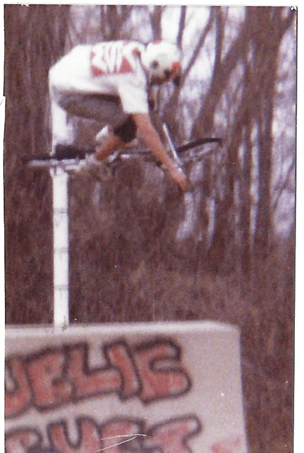

# showimg

A simple tool for displaying images using OpenCV and Rust

## Prerequisites

- OpenCV

## Build

```bash
cargo build --release
```

## Usage

Path to file:

```bash
./showimg img/sjb-aerial.png 
```

Piped from stdin:

```bash
cat ./img/sjb-aerial.png | showimg
```

or

```bash
showimg < ./img/sjb-aerial.png
```

